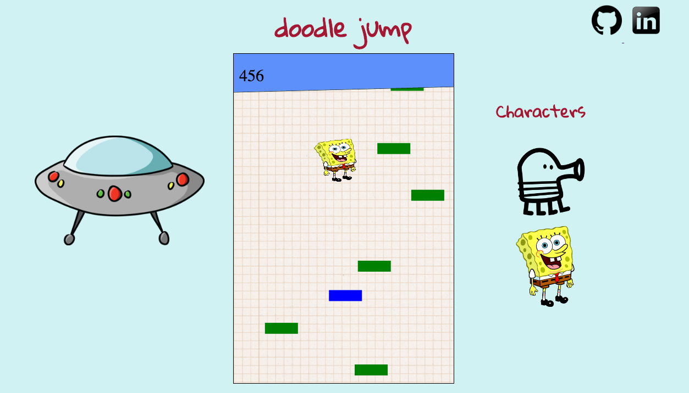

# Doodle Jump

[Live on Github Pages](https://kevinmoore9.github.io/doodlejump/)

This repository holds my rendition of the classic mobile game, DoodleJump. It is built using JavaScript, HTML5, and CSS3. All credit of the gameplay goes to the creator. All of the code, however, is my own.

## Features

The main focus of the application is the JavaScript recreation of the classic mobile game, DoodleJump. Unlike the original released on the iPhone, this version uses the keyboard arrow keys to control your character. In addition to the gameplay, there are also a few added features to note:

* Select from the characters on the right to change your jumper
* Links to my personal LinkedIn and Github pages

## Implementation

The logic for the DoodleJump gameplay is all held within three separate scripts, each controlling a single class type. In doodle.js, all logic for creating, moving and drawing the character is held. In block.js, all similar logic for each individual platform block is held. This includes creating different block types. Finally, all logic of the gameplay itself is held in game.js. Among the most important logic here is:

* Randomly creating new reachable, yet dispersed blocks
* Scrolling the canvas window too keep the character in view
* Tracking and rendering score

All three script files are instantiated through an entry file, main.js, and are compiled into one bundle.js file using Webpack.

Styling is all done with HTML5 and CSS3.

## Technology

My implementation of Doodle Jump uses a variety of technologies in it's implementation including:

* Node.js
* HTML5
* Canvas API
* CSS 3
* Webpack

## Future Additions

While a complete and entertaining game, this rendition of DoodleJump is still a growing project with new changes to come, including:

* Add new background themes / characters
* Create new block types including breakable blocks and blocks with springs
* Add music that coincides with the gameplay
